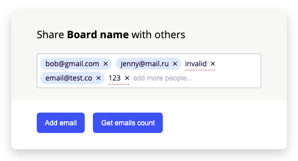

# emails-input.js

A JavaScript library for entering and validating emails. It adds emails in a view of blocks with buttons for deleting them from the list.



## ✨Demo

You can see a [live demo here](https://bahkostya.github.io/emails-input/dist/) and a build [here](https://github.com/bahkostya/emails-input/tree/gh-pages/dist/lib).

## 🎨 Features

* Dependency free.
* Email block is created by pressing Enter, entering comma, or by losing focus on the
input field.
* Block can be deleted by pressing cross icon.
* Pasted emails are converted into blocks immediately. If multiple comma-separated
emails are pasted (e.g., `"ivan@mail.ru, max@mail.ru"`), they are converted into multiple
blocks.
* "Add email" button adds a random email to the list.
* "Get emails count" button shows an alert with valid emails count. 

## 🔨 Usage

1. Include the stylesheet and fonts
  ```html
  <link rel="stylesheet" href="path/to/emails-input.css">
  <link href="https://fonts.googleapis.com/css2?family=Open+Sans:wght@400;700&display=swap" rel="stylesheet" />
  ```

2. Add the library script and initialize it on DOM element
  ```html
  <div id="emails-input"></div>

  <script src="path/to/emails-input.js"></script>
  <script>
    const inputContainerNode = document.querySelector('#emails-input');
    const emailsInput = EmailsInput(inputContainerNode, {
      // Initialization options go here
    });
  </script>
  ```

## Initialization Options

When you initialize the input, the first argument is the DOM element, and the second is an object containing initialization options, which are detailed below.

**placeholder**  
Type: `String` Default: `add email...`  
String show in a placeholder of an input.

## Public Methods
In these examples, `emailsInput` refers to the instance which gets returned when you initialize it e.g.:
```js
const emailsInput = EmailsInput(inputContainerNode);
```

**add**  
Add new email to the list. Accepts 1 argument, `String`.
```js
const { isValid } = emailsInput.add('example@mail.com');
```
Returns a an object with validity of passed email, where `isValid` field is `Boolean`:
```js
{ isValid: true }
```

**geAll**  
Get all emails listed in input.
```js
const allEmails = emailsInput.getAll();
```
Returns an array of objects with emails and their validity, where `email` field is `String` and `isValid` is `Boolean`:

```js
[
  {
    email: "firstname.lastname@example.com",
    isValid: true,
  },
  {
    email: "plainaddress",
    isValid: false,
  },
  {
    email: "email@subdomain.example.com",
    isValid: true,
  },
  {
    email: "#@%^%#$@#$@#.com",
    isValid: false,
  }
]
```

**destroy**  
Remove the input from the DOM and unbind any event listeners.  
```js
emailsInput.destroy();
```

## 🌏 Browser Support
|  Chrome |  Internet Explorer |  Edge |  Safari |  Firefox |
| :---------: | :---------: | :---------: | :---------: | :---------: |
| Latest | 11+ | Latest | Latest | Latest |